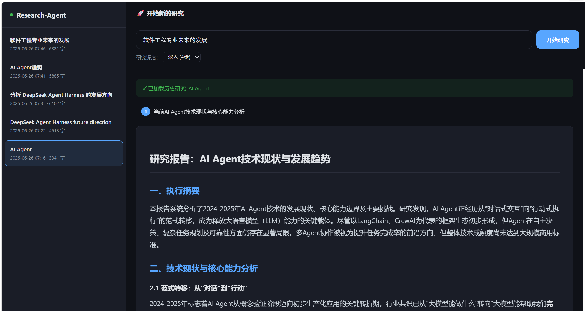

# Research-Agent

**多智能体协作研究系统** — 输入主题，自动完成：任务规划 → 信息收集 → 报告生成。
## Demo


```
http://127.0.0.1:8001
```

---

## 项目结构

```
Research-Agent/
│
├── app/
│   ├── agents/                    # 智能体模块
│   │   ├── base_agent.py          # 基类：LLM 调用 + 工具注册
│   │   ├── planner_agent.py       # 规划智能体：拆分研究步骤
│   │   ├── researcher_agent.py    # 研究智能体：调用工具收集信息
│   │   └── writer_agent.py        # 写作智能体：生成 Markdown 报告
│   │
│   ├── memory/
│   │   └── memory_manager.py      # 长期记忆：SQLite 存储历史研究
│   │
│   ├── tools/
│   │   ├── base_tool.py           # 工具基类：name/description/parameters/run()
│   │   ├── web_search_tool.py     # 搜索工具：DeepSeek 驱动的研究搜索
│   │   └── report_tool.py         # 报告工具：保存 Markdown 到磁盘
│   │
│   ├── api/
│   │   └── routes.py              # API：SSE 流式研究 + REST 端点
│   │
│   ├── config.py                  # 配置：API Key、模型、路径
│   └── main.py                    # 入口：FastAPI + Web 前端
│
├── tests/
│   └── test_agents.py             # 单元测试（13 个）
│
├── docs/                          # 文档
├── reports/                       # 生成的报告（自动创建）
│
├── .env                           # API Key 配置
├── .env.example                   # 配置模板
├── init_db.py                     # 数据库初始化
├── start.bat                      # Windows 一键启动
├── requirements.txt               # Python 依赖
└── README.md
```

---

## 快速开始

### 1. 配置 API Key

编辑 `.env`，填入你的 DeepSeek API Key（已配置则跳过）：

```env
DEEPSEEK_API_KEY=sk-your-key
```

### 2. 初始化数据库

```bash
python init_db.py
```

### 3. 启动

```bash
# Windows：双击 start.bat

# 或命令行：
uvicorn app.main:app --app-dir E:\Tom\Research-Agent --host 127.0.0.1 --port 8001
```

### 4. 打开浏览器

```
http://127.0.0.1:8001
```

---

## 使用方式

| 方式 | 说明 |
|------|------|
| **Web 界面** | 打开 `http://127.0.0.1:8001`，输入主题即可，实时显示进度和报告 |
| **API** | `POST /api/research` — 同步调用 |
| **流式 API** | `GET /api/research/stream?topic=xxx` — SSE 实时推送 |

---

## API 端点

| Method | Path | 说明 |
|--------|------|------|
| `GET` | `/` | Web 前端界面 |
| `GET` | `/api/research/stream` | SSE 流式研究（实时进度） |
| `POST` | `/api/research` | 同步研究 |
| `GET` | `/api/history` | 历史记录列表 |
| `GET` | `/api/research/{id}` | 查看研究详情 |
| `DELETE` | `/api/research/{id}` | 删除研究 |
| `GET` | `/health` | 健康检查 |

---

## 架构设计

```
用户输入主题
     │
     ▼
┌──────────────┐     ┌───────────────┐     ┌──────────────┐
│ PlannerAgent │ ──▶ │ResearcherAgent│ ──▶ │ WriterAgent  │
│ 分析 → 拆分   │     │ 搜索 → 收集    │     │ 汇总 → 报告   │
└──────────────┘     └───────┬───────┘     └──────┬───────┘
                             │                     │
                      ┌──────┴──────┐       ┌──────┴──────┐
                      │ WebSearch   │       │  ReportTool │
                      │ Tool        │       │  保存 .md    │
                      └─────────────┘       └──────┬──────┘
                                                   │
                                            ┌──────┴──────┐
                                            │ MemoryManager│
                                            │ SQLite 持久化 │
                                            └─────────────┘
```

### 设计原则

- **Tool Calling** — 标准 OpenAI function-calling 协议，每个工具定义 name/description/parameters
- **Multi-Agent** — Planner → Researcher → Writer 三元协作，各司其职
- **Long-Term Memory** — SQLite 存储，支持历史检索和上下文增强
- **SSE Streaming** — 实时推送研究进度，用户可见每个阶段

---

## 技术栈

| 组件 | 技术 |
|------|------|
| 后端框架 | FastAPI |
| LLM | DeepSeek API（兼容 OpenAI） |
| 数据库 | SQLite |
| 前端 | 原生 HTML/CSS/JS + marked.js |
| 实时通信 | Server-Sent Events (SSE) |

---

## 测试

```bash
python -m pytest tests/ -v
# 或
python -c "from tests.test_agents import *; ..."
```

当前 13 个测试全部通过。

---

## 切换 LLM

编辑 `.env`：

```env
LLM_PROVIDER=openai
OPENAI_API_KEY=sk-your-openai-key
OPENAI_MODEL=gpt-4o
```

无需改任何代码 — 所有 LLM 调用使用 OpenAI 兼容接口。
